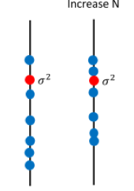
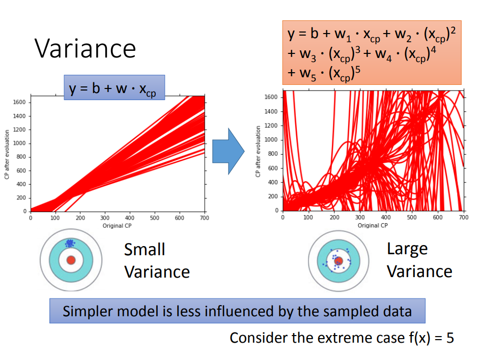
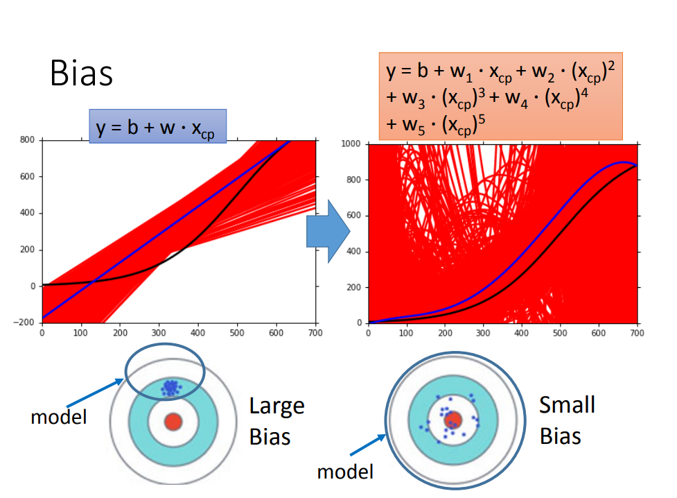

# 誤差(Error)從哪裡來的?

從 Chapter 3 的測試資料來看，`Average error` 會隨著模型複雜度增加呈上升趨勢，表示更複雜的模型並不能給測試資料帶來更好的預測效果。

而這些 `error` 的主要來源有兩種，分別是 `bias(偏差)` 和 `variance(變異數 或 方差)`。

<!-- 然而 $bias$ 和 $variance$ 是什么？可以查看 [机器学习中的Bias(偏差)，Error(误差)，和Variance(方差)有什么区别和联系？](https://www.zhihu.com/question/27068705) -->

## 估測(Estimation)

假設真實的函數為 $\hat f$，但是這函數只有 Niamtic 公司才知道。

所以我們只能透過蒐集寶可夢資料，然後透過 Chapter3 Step1 ~ Step3 來訓練我們的假想模型，並得出我們的理想函數集 $f^*$，但 $f^*$ 不過只是我們針對 $\hat f$ 的預估。

這過程像是打靶，$\hat f$ 是靶心，$f^*$ 是我們射擊的結果。

如上圖，$\hat f$ 與 $f^*$ 之間的差距就是 `bias` 加上 `variance` 所導致的。

### 統計學中的估測

可以從統計學的例子來理解上述估測中的 `bias` + `variance`。

#### 估測 $x$ 的算數平均

假設 $x$ 的算數平均為 $\mu$，變異數(方差)為 $\sigma^2$

在統計學中，要如何估測算數平均呢?

- 首先拿到 $N$ 個樣本：$\{x^1,x^2,···,x^N\}$
- 計算樣本的算數平均 $m$, 此時 $m=\frac{1}{N}\sum_n x^n \neq \mu$
- 接著計算很多組的 $m$，然後求 $m$ 的期望值：$E[m]=E[\frac{1}{N}\sum x^n]=\frac{1}{N}\sum_nE[x^n]=\mu$

這種估測方式稱為無偏差估測(Unbiased Estimator)

$m$ 分布對於 $\mu$ 的離散程度取決於變異數：$Var[m]=\frac{\sigma^2}{N}$

可以看得出 $N$ 越大，離散程度越小(如下圖)

#### 估測 $x$ 的變異數(方差)

在來看統計學中，要如何估測變異數(方差)呢?

- 同樣首先拿到 $N$ 個樣本：$\{x^1,x^2,···,x^N\}$
- 利用前一小節估測出來的 $m$，計算出樣本變異數: $s^2=\frac{1}{N}\sum_n (x^n-m)^2$
- 計算很多組 $s^2$ 的期望值: $E[s^2]=\frac{N-1}{N}\sigma^2$

由期望值可推得出 $s^2$ 出現小於 $\sigma^2$ 的次數會相對較多。

所以理論上 $N$ 愈大時 $s^2$ 估測出來的值會越接近 $\sigma^2$。(如下圖)

--

接下來，我們看回到機器學習中估測出來的 `bias` + `variance`。

我們要估測的是靶心 $\hat f$；接著我們蒐集了好幾次資料，而他們落在 $f^*$ 這些藍點位置。

於是乎我們可以算這些 $f^*$ 的期望值：$E[f^*] = \bar f$

> $\bar f$ 與靶心(也就是 $\hat f$)偏移了一段誤差(error)，我們稱作 `bias`。

以打靶為例，就是你以為靶心在 $\bar f$ 的位置，但其實不然，導致你瞄靶的時候就沒有瞄準，這中間的誤差(error)就是 `bias(偏差)`。

> 另外一個誤差(error)，我們可以看到每個藍點(每個 $f^*$)都會離 $\bar f$ 的位置又再偏差一些位置，而這個稱作 `variance`。

又以打靶為例，因為可能槍枝的不同，每次打出的子彈都可能有些許的不同，這中間的誤差(error)就是 `variance`。

以上就能知道誤差從哪來的呢?  
有可能來自兩個地方一個是 `bias`，另一個則是 `variance`。

### 怎麼找出不同的最佳函數呢?

我們知道每個 $f^*$ 代表一組資料針對一個模型找出來的最佳函數，但如何找出更多的 $f^*$ 呢?

我們回到 Chapter 3 最一開始，假設這個世界有平行宇宙，在不同的宇宙我們都抓了不同的 10 隻寶可夢。

每個宇宙，用同一個模型(model)[ $y = b + w · x_{cp}$ ]，但不同的訓練資料(training data)，就可以找到不同的 $f^*$。

> 當然實際上的情況(如果真的沒有平行宇宙)，就是做 100 次實驗，每次都抓 10 隻不同的寶可夢。 😂

--

現在我們想知道這些 $f^*$ 的散布是怎麼樣的，直接將不同模型的 $f^*$ 畫出來，如下圖。

### 不同模型的變異數(方差)

由下圖顯示，比較簡單的模型(如一次式函數 $y = b + w·x_{cp}$)，變異數(variance)；也就是離散程度會比較小。  
反之，複雜的模型(五次式函數 $y = b + w_1·x_{cp} + w_2·(x_{cp})^2+...$)，離散程度比較大。

> 可以舉極端一點的例子來理解，如果給一個最簡單的模型 $y = c$，那他的變異數(variance)是 0。  
> 因為沒有任何訓練資料會影響到它，複雜度越高的模型因為參數項更多，自然受到訓練資料的影響就越大，離散程度也就越大。

### 不同模型的偏差

前面提到偏差的計算方式，就是找 $E[f^*] = \bar f$ 然後看他與真正的 $\hat f$ 所差的距離。

但因為沒辦法知道真正的 $\hat{f}$，所以假設圖中黑色曲線為真正的 $\hat{f}$

可視化後(如下圖)

一次式的 $\bar{f}$ 沒有五次的好，雖然五次的整體結果離散程度很高。 
但一次式模型的偏差比較大，而複雜的五次式模型，偏差就比較小。

> 直觀的解釋：簡單的模型函數集比較小，所以函數集裡面可能本來就沒有包含靶心，肯定射不中。  
> 而複雜的模型函數集比較大，就可能包含靶心。

### 偏差 v.s. 變異數(方差)

簡單模型(左邊)是偏差比較大造成的誤差，這種情況叫做低度擬合(`Underfitting`)。  
而複雜模型（右邊）是變異數(方差)過大造成的誤差，這種情況叫做過度擬合(`Overfitting`)。

## 如何處理誤差?

### 分析

如果模型沒有很好的訓練集，會導致偏差過大，也就是低度擬合(`Underfitting`)。

如果模型很好的訓練集，有可能在訓練集上得到很小的錯誤，但在測試集上得到大的錯誤，  
這意味著模型可能是變異數(方差)比較大，就是過度擬合(`Overfitting`)。

對於低度擬合和過度擬合，可以用不同的方式來處理。

### 如何處理高偏差?

因為之前模型所包含的函數集裡面可能根本沒有包含$f^*$，所以需要重新設計模型:

* 可以將更多的參數加進去，比如考慮高度重量，或者HP值等等。
* 考慮更多次冪、更複雜的模型。

如果此時強行再收集更多的data去訓練，這是沒有什麼幫助的。因為設計的函數集本身就不好，再找更多的訓練集也不會更好。

### 如何處理高變異數(方差)?

* 蒐集更多的資料(簡單粗暴的方式)

> 很多时候不一定能做到蒐集更多的資料。但可以針對問題的理解對資料集做調整，並產生更多的訓練資料。
> 
> 例如:
> * 手寫數字辨識，偏轉角度的資料集不夠，那就將正常的資料集左轉15度，右轉15度。
> * 語音辨識，用變聲器自己製造不同性別的資料。
> * 翻譯功能，可以硬把資料做其他語言翻譯後，當作訓練資料。
> 
> ... 等類似這樣的處理。

* 正規化(`Regularization`)

在 Chapter3 有提到，正規化就是將原本複雜的模型加上一些限制，讓曲線變得平滑。

> 正規化有可能會增加偏差(bias)，有時需要取得一些偏差(bias)與變異數(variance)上的平衡。

## 模型的選擇

想選擇的模型，可以平衡偏差和方差產生的誤差，使得總誤差最小

但是下面這件事最好不要做：

用訓練集訓練不同的模型，然後在測試集上比較錯誤，模型3 的錯誤比較小，就認為 模型3 好。  
但實際上這只是你手上的測試集，真正完整的測試集並不一定是最好的。  
比如在已有的測試集上錯誤是0.5，但有條件收集到更多的測試集後通常得到的錯誤都是大於0.5的。

### 交叉驗證(Cross Validation)

圖中 public 是已有的測試集，private 是我們不知道的測試集。

交叉驗證 就是將訓練集再分為兩部分，一部分作為訓練集，一部分作為驗證集。  
用 **訓練集** 訓練模型，然後再用 **驗證集** 比較，確實出最好的模型之後（比如模型3），再用 **全部的訓練集** 訓練模型3。

接下來再用 public 的測試集進行測試，此時一般得到的錯誤都是大一些的。  
不過此時會想再回去調一下參數，調整模型，讓在 public 的測試集上表現更好看，但不太推薦這樣。

--

如果擔心上述方法，將訓練集拆分後訓練的效果比較差，可以用下面的方法。

### N-折交叉驗證(N-fold Cross Validation)

將訓練集分成 N 份。

例如分成三份，在三份中訓練結果平均誤差(Average Error)是 模型1 最好，再用全部訓練集訓練模型1。
