# 分類(Classification)

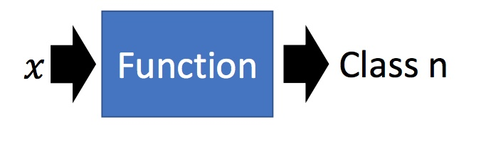

分类要找一个函数(Function)，输入对象 $x$ 特征，输出是该对象属于 n 个类别中是属于哪一个。

## 實際應用

- 信用評分 (二元分類問題)
    - 輸入：收入，儲蓄，行業，年齡，金融史…
    - 輸出：是否拒絕拒絕貸款
- 醫療診斷 (多元分類問題)
    - 輸入：當前症狀，年齡，性別，醫療史…
    - 輸出：患了哪種疾病
- 手寫文字辨識 (多元分類問題)
    - 輸入：手寫的文字
    - 輸出：約9353個漢字中輸入哪一個
    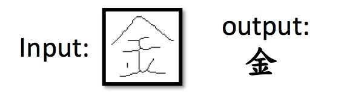
- 人臉辨識

## 寶可夢屬性分類

首先認識一下寶可夢中的屬性分類：
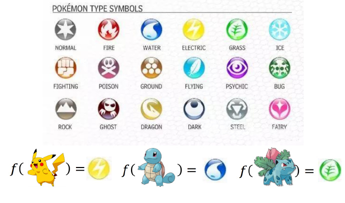

寶可夢有很多的屬性，比如電，火，水。要做的就是一個分類的問題：需要找到一個函數，

- 輸入：一隻寶可夢的特徵（整體強度，生命值，攻擊力，防禦力，特殊攻擊力，特殊防禦力，速度等）
- 輸出：屬於哪一種類型的寶可夢

首先將寶可夢數值化：以皮卡丘為例

- Total：整體強度，大概的表述寶可夢有多強，320
- HP：生命值，35
- Attack：攻擊力，55
- Defense：防禦力，40
- SP Atk：特殊攻擊力，50
- SP Def：特殊防禦力，50
- Speed：速度，90

所以我們可以將一隻寶可夢用一個 7 個數字組成的向量座表示。

做這有什麼用呢? 可以預測對手出現了一隻不在圖鑑上的寶可夢屬性，並依照下圖，做出戰略的對應。

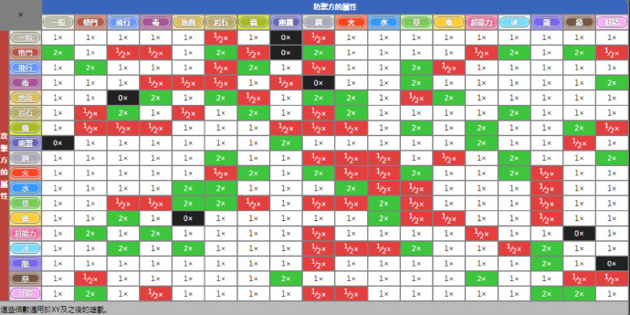

### 如何做到分類?

#### 將分類問題(Classification) 視作迴歸問題(Regression)?

舉一個二元分類(binary classification)的例子，假設輸入神奇寶貝的特徵 $x$，判斷屬於 Class1 或者 Class2，把這個當作迴歸問題。

- Class1：相當於 target 是 1。
- Class2：相當於 target 是 -1。

然後訓練模型：因為做完迴歸會是個數值，如果數值比較接近 1，就當作 Class1，如果數值接近 -1，就當做 Class2。

然而，這樣做遇到什麼問題呢？

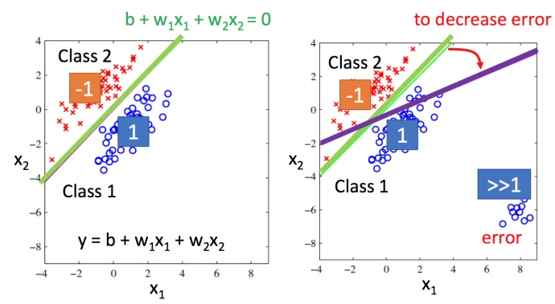

- 左圖：綠色是分界線，紅色叉叉就是 Class2 的類別，藍色圈圈就是 Class1 的類別。
- 右圖：紫色是分界線，紅色叉叉就是 Class2 的類別，藍色圈圈就是 Class1 的類別。訓練集添加有很多的距離遠大於1 的資料後，分界線從綠色偏移到紫色

右圖用迴歸的方式硬訓練可能會得到紫色的這條，直觀上就是將綠色的線偏移一點到紫色的時候，就能讓右下角的那部分的值不是那麼大；但顯然實際上是綠色的才是比較好的。

**此時可以得出用迴歸的方式來處理分類問題是不適用的。**(因為迴歸方式會懲罰那些太正確的資料。)

另外有人也會用迴歸方式處理多分類問題，Class1 當作 target 是 1，Class2 當作 target 是 2， Class3 當作 target 是 3 ...。

如果這樣做的話，就會預設 Class2 和 Class3 是比較接近的，認為它們是有某種關係的；Class1 和 Class2 也是有某種關係。但是實際上這種關係不存在的時候，是沒有辦法得到好的結果。(**並不推薦這麼做**)

#### 理想方法

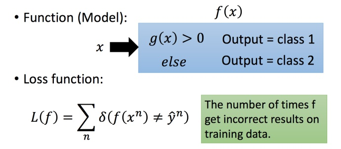

* 考慮二元分類，希望在模型中找到一個函數，帶入 $x$ 大於 0 時就是 Class 1，否則就是 Class 2。
* 其損失函數就定義為在訓練集上面預測的錯誤次數加總。

但就我們目前的學到的方式是無法做到的，因為以上定義出來的函數都是不可微分的，意味著無法用梯度下降法(GD)...

> 實際上是有方式可以達成，如 Perceptron (感知器), SVM

---

不過還是有別種方法，我們先以機率的觀點來看待分類問題。

### 機率觀點看待分類問題

#### 抽球機率問題

假設有兩個盒子，各裝了5個球，$2/3$ 的機率會選擇從 盒子1 抽球 ，$1/3$ 的機率會從 盒子2 抽球。

而從盒子中藍色球和綠色球的分配可以得到：

- 在 盒子1 中隨機抽一個球，是藍色球機率為 $4/5$，綠色球機率為 $1/5$
- 在 盒子2 中隨機抽一個球，是藍色球機率為 $2/5$，綠色球機率為 $3/5$

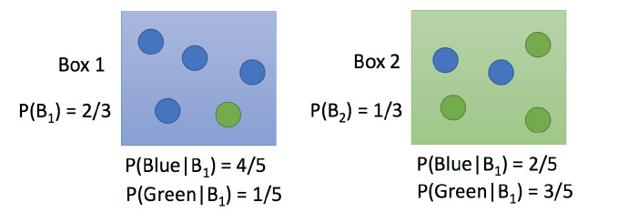

現在求隨機從兩個盒子中抽一個球，抽到的是 盒子1 中藍色球的機率是多少？

$
\begin{aligned} 
P(B_1|Blue) &= \frac{P(Blue|B_1)P(B_1)}{P(Blue|B_1)P(B_1)+P(Blue|B_2)P(B_2) } \\
& = \cfrac{\cfrac{4}{5} * \cfrac{2}{3}}{\cfrac{4}{5} * \cfrac{2}{3}+\cfrac{2}{5}* \cfrac{1}{3}} 
= \cfrac{4}{5}
\end{aligned} 
$

#### 機率與分類

將抽球機率置換成分類機率，假設我們資料分成了如下圖的兩類，Class1 和 Class2。

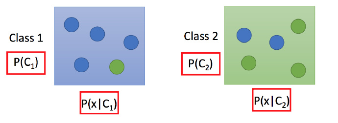

如果知道上圖紅框內四種機率值，我可以推導出:

$P(C_1|x) = \cfrac{ P(x|C_1)P(C_1)} {P(x|C_1)P(C_1) + P(x|C_2)P(C_2) }$

> $P(C_1)$: 資料從 Class1 選的機率。  
> $P(C_2)$: 資料從 Class2 選的機率。  
> $P(x|C_1)$: 從 Class1 選出資料 $x$ 的機率。  
> $P(x|C_2)$: 從 Class2 選出資料 $x$ 的機率。  
> $P(C_1|x)$: 從全部的資料中選出來的 $x$，是從 Class1 中選出來的機率；也代表著資料 $x$ 被分類成 Class1 的機率。

而我們希望從訓練集中，把上圖中的四個機率值估測出來，這一整套想法稱作**生成模型**(Generative Model)。

--

為何稱作**生成模型**? 

因為有這個模型，就能生成 $x$，並計算其生成的機率 $P(x)$。

$P(x) = P(x|C_1)P(C_1) + P(x|C_2)P(C_2)$

> $P(x)$: 從全部的資料中選出 $x$ 的機率。  

### 寶可夢分類問題

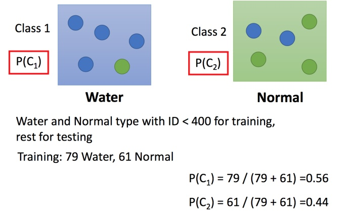

先考慮簡單的寶可夢二分類，水系或者一般系，通過訓練集的數據可以計算出 $P(C_1)$ 和 $P(C_2)$，如圖所示：

- 水系佔比：$P(C_1) = 0.56$
- 一般系佔比：$P(C_2) = 0.44$

--

接下來我們想計算沒見過的海龜(寶可夢)是水系的機率，即 $P(x|C_1)$。

在模型中，每隻寶可夢，我們輸入的是寶可夢的能力數值，為一個特徵向量(vector)。

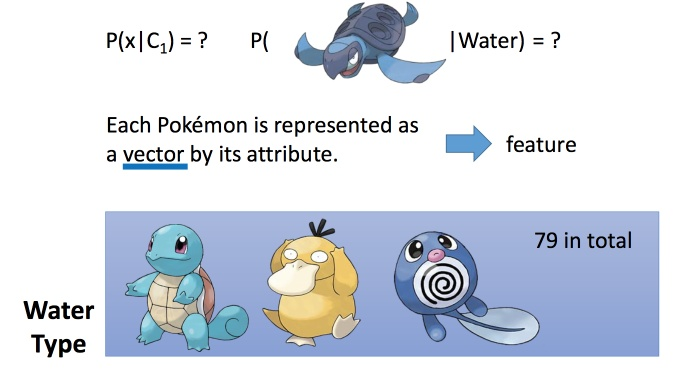

--

於是我們將寶可夢資料，依照 `Defense` 和 `SP Defense` 這兩個數值可視化。

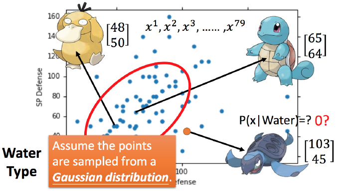

不過從上圖中，我們怎麼估測海龜是水系的機率呢?

我們可以想像訓練集的水系寶可夢，只是眾多資料的冰山一角，是從一個常態機率分布(**高斯分布**)裡面取樣 79 個出來的。

### 高斯分布(Gaussian distribution)

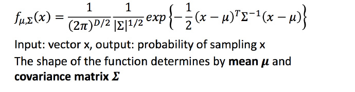

> $x$: 輸入向量。  
> $f_{\mu,\Sigma}(x)$: 輸出機率密度(probability density)，與機率成正比。  
> $\mu$: 平均數向量 (mean)  
> $\Sigma$: 共變異數矩陣 (covariance matrix)

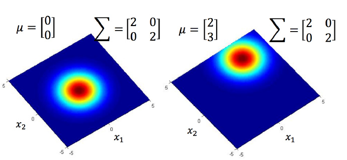

$\mu$ 相同，$\Sigma$ 不同

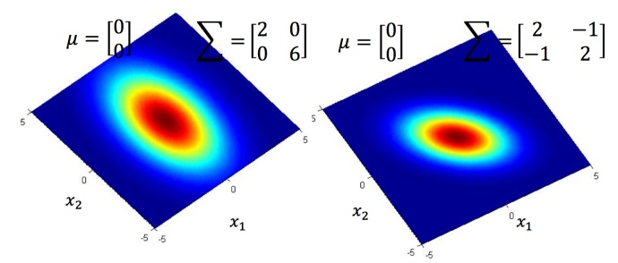

$\mu$ 不同，$\Sigma$ 相同

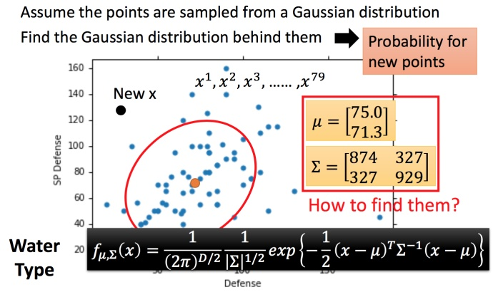

假設通過 79 個點估測出了 $\mu$ 和 $\Sigma$。$\mu$ 是圖中的黃色點，$\Sigma$ 是紅色的範圍。

給一個不在 79 個點之內的新點，就可以用剛才估測出的 $\mu$ 和 $\Sigma$ 寫出高斯分佈的函數 $f_{\mu,\Sigma}(x)$，然後把 $x$ 帶進去，計算出被挑選出來的機率。

### 最大似然值(Maximum Likelihood)

如何找高斯分佈函數中的 $\mu$ 和 $\Sigma$ 呢?

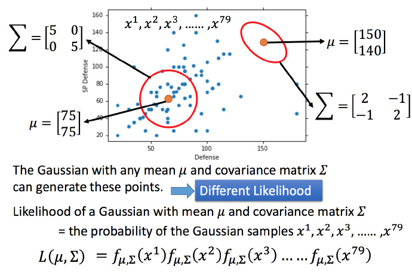

我們所取樣的 79 個資料，可能是從任何一個高斯分佈取樣出來的。(因為任何高斯分佈都有可能取樣出圖上的任何一點，只是機率高低不同而已)

不過每一個高斯分佈能取樣出這 79 個點的機率是不一樣的，所以我們需要利用這 79 個點來找出最有可能取樣出他們的高斯分佈。

$L(\mu,\Sigma) = f_{\mu,\Sigma}(x^1)f_{\mu,\Sigma}(x^2) ... f_{\mu,\Sigma}(x^79)$

> $L(\mu,\Sigma)$: 似然函數(Likelihood function)
> $f_{\mu,\Sigma}(x) = \cfrac{1}{(2\pi)^{D/2}} \cfrac{1}{|\Sigma|^{1/2}} \exp \left\{ -\cfrac{1}{2}(x-\mu)^T\Sigma^{-1}(x-\mu) \right\}$

$( \mu^*, \Sigma^* ) = arg \max_{\mu,\Sigma}L(\mu,\Sigma)$

> $( \mu^*, \Sigma^* )$: 為最有可能高斯分布的 $\mu$ 和 $\Sigma$

--

以 79 個點為例，$(x^1, ..., x^{79})$ 帶入分別對 $\mu,\Sigma$ 取偏微分，解微分為 0 的值。

$\mu^* = \cfrac{1}{79} \Sigma_{n=1}^{79} x^n$

$\Sigma^* = \cfrac{1}{79} \Sigma_{n=1}^{79} (x^n-\mu^*)(x^n-\mu^*)^T$

### 使用高斯分布與最大似然值

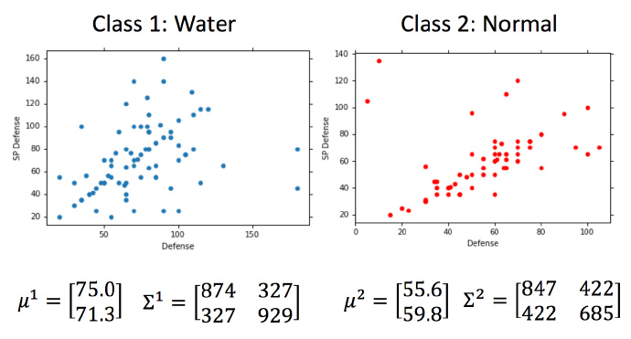

將實際資料帶進前一節的 $(\mu^*, \Sigma^*)$，分別得出水系和一般系寶可夢最大似然值中的 $(\mu,\Sigma)$。

得知 $(\mu,\Sigma)$ 後便可求出 $P(x|C_1), P(x|C_2)$ (高斯分布函數)，進而得出 $P(C_1|x)$

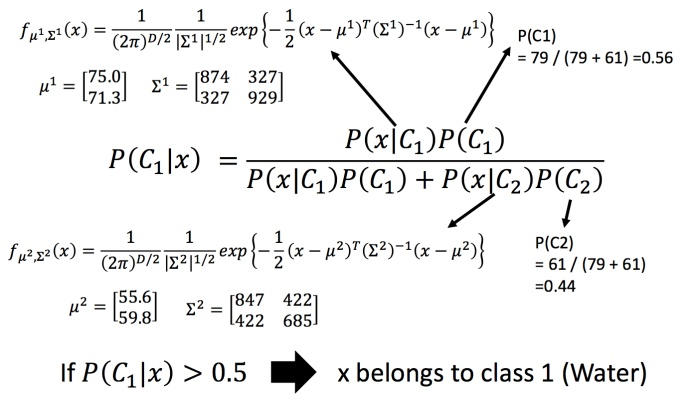

接下來我們作圖將並顯現在參數 `Defense` 和 `SP Defense` 的分類效果。

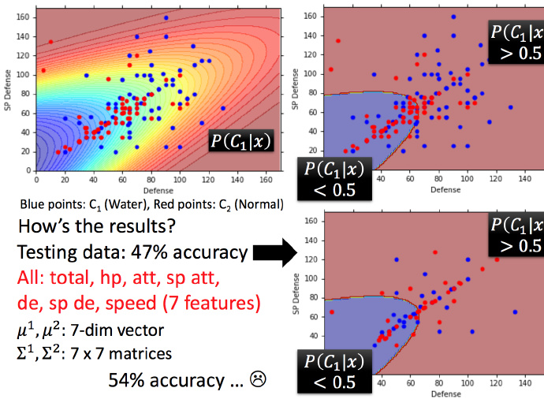

藍色點代表水系寶可夢，紅色點代表一般系寶可夢。  
紅色區代表被分類成水系，藍色區代表被分類成一般系。

雖然水系大部分有被分在紅色區，一般系大部分有被分在藍色區，不過在測試集上表現就不行了。(用肉眼看其實就很明顯)

那我們把剩下的參數(HP、攻擊力...等)都考慮進去，變成七維空間的分類呢?

很可惜，做出來不盡人意，只有 54% 的正確率...

### 修改模型

前面所使用的模型似乎不盡理想，那要怎麼辦呢?

其實前述的方法；給每個分類完全不同的高斯分布的參數是不常見到的...  
Class1 是 ($\mu^1,\Sigma^1$)；Class2 是 ($\mu^2,\Sigma^2$) 參數太多了。

比較常見的方式會給每個分類同一個 $\Sigma$ (covariance)

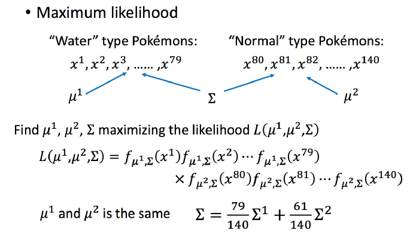

修改前的做法會針對每個分類列出自己的 $L(\mu,\Sigma)$ 進而算出 $(\mu,\Sigma)$。

修改後，必須把分類合併考慮列出 $L(\mu^1,\mu^2,\Sigma)$ 進而算出 $(\mu^1,\mu^2,\Sigma)$。  
其中，$\Sigma = \cfrac{79}{140} \Sigma^1 + \cfrac{61}{140} \Sigma^2$

--

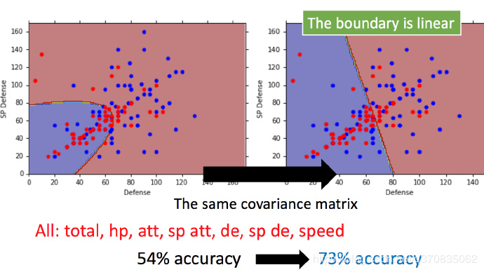

共用同一個 $\Sigma$ 後，參數 `Defense` 和 `SP Defense` 的分類界線會變成 linear 的(lineal model)。

在七個參數，七維空間上的分類準確率也提升至 73%。

> 我們人無法馬上在高維空間中找到適當得分類界線，但機器可以。
> 這也是機器學習 fancy 的地方。

---

## 分類模型三步驟

在第三章的時候有討論到(線性)回歸模型三步驟，這邊依照同樣的步驟邏輯，套用在分類模型上。

### Step1: 模型假設 - 機率模型

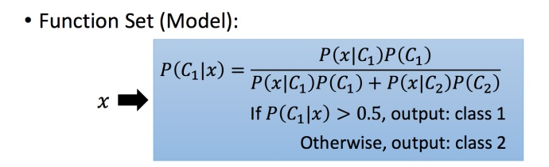

模型的函數為 $P(C_1|x) = \cfrac{ P(x|C_1)P(C_1)} {P(x|C_1)P(C_1) + P(x|C_2)P(C_2) }$ 

### Step2: 模型評估 - 最大似然值

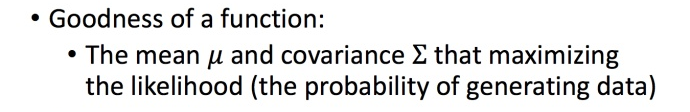

找一組 $(\mu,\Sigma)$ 最有可能取樣(產出)出資料

### Step3: 最佳模型

過程相當繁瑣，但容易(微分就可取得)

--

那麼為何要選擇高斯分布來當機率模型呢?

其實沒有一定要用高斯分布，你永遠可以選擇喜歡的機率模型，差別只會在 `bias` 和 `variance` 的大小。

## 後驗機率 (Posterior Probability)

> 先驗機率(Prior Probability)：事件發生前的預判機率。可以是基於歷史數據的統計，可以由背景常識得出，也可以是人的主觀觀點給出。一般都是單獨事件機率，如P(x),P(y)。  
> 後驗機率(Posterior Probability)：事件發生後求的反向條件機率；或者說，基於先驗機率求得的反向條件機率。機率形式與條件機率相同。  
> 條件機率：一個事件發生後另一個事件發生的機率。一般的形式為P(x|y)表示y發生的條件下x發生的機率。
>
> 原文網址：https://kknews.cc/code/qomypno.html

$
\begin{aligned} 
P(C_1|x) &= \cfrac{P(x|C_1)P(C_1)} {P(x|C_1)P(C_1) + P(x|C_2)P(C_2) } [同除分子 P(x|C_1)P(C_1)] \\
&= \cfrac{1}{1+\cfrac{P(x|C_2)P(C_2)}{P(x|C_1)P(C_1)}} [令 z=\ln\cfrac{P(x|C_1)P(C_1)}{P(x|C_2)P(C_2)}] \\
&= \cfrac{1}{1+\exp(-z)} = \sigma(z)
\end{aligned} 
$

> $\sigma(z)$: Sigmoid Function
>
> 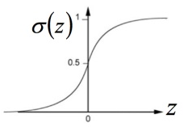

--

一番數學推導後，(可參考影片[ML Lecture 4: Classification - 1:01:05](https://youtu.be/fZAZUYEeIMg?t=3665))

$P(C_1|x) = \sigma(z) = \sigma(w \cdot x + b))$

那我們何須再算 $(\mu,\Sigma)$，能直接找出 $w$ 和 $b$ 嗎?

下回分曉~
